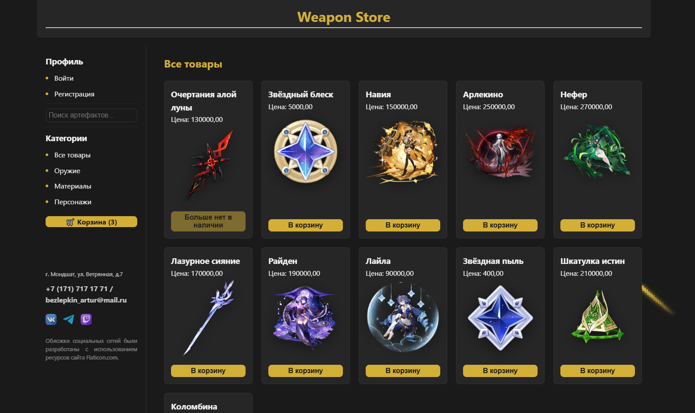

# ⚔️ Game Items STORE V.2 — Магазин тематических товаров из игры "Genshin Impact".

Веб-сайт разработанный на **Django 6.0.2**, вдохновленный стилем Genshin Impact. 
Проект включает в себя полноценный функционал интернет-магазина.
## Ссылка на рабочий сайт развёрнутый через хостинг Amevra: [Посмотреть проект](https://gameitemsstore2-ancientsteal.amvera.io)

## 🚀 Основные возможности

- [x] Просмотр каталога товаров
- [x] Авторизация пользователей
- [x] Фильтрация списка товаров по категориям и через живой поиск
- [x] Корзина покупок
- [x] Оформление заказа
- [x] Панель администратора (Django Admin)

*   **Живой поиск**: Мгновенная фильтрация товаров без перезагрузки страницы (AJAX).
*   **Возможность просмотра деталей**: Подробное описание товара доступно на отдельной странице.
*   **Живой поиск**: Фильтрация товаров без перезагрузки страницы (AJAX).
*   **Бесконечный скролл**: Автоматическая подгрузка карточек товаров при прокрутке вниз (Intersection Observer API).
*   **Интерактивная корзина**: Интерфейс добавления/удаления товаров с пересчетом итоговой суммы (AJAX).
*   **Адаптивная вёрстка**: Сайт корректно отображается на ПК и мобильных устройствах.
*   **Защита лимитов**: Автоматическая блокировка кнопок покупки или процесса оформления заказа при отсутствии нужного количества товаров на складе.

## 📸 Скриншот каталога товаров

## 🛠 Технологический стек

 


*   **Backend**: Python 3.12, Django 6.0.2
*   **Database**: PostgreSQL (Neon.tech для сервера).
*   **Frontend**: *JavaScript* (Vanilla ES6+), *CSS3* (Flexbox/Grid), *HTML5*.
*   **Deployment**: *Amvera Cloud* (облако для хостинга), 
*WhiteNoise* (для раздачи статических файлов, не нужно настраивать отдельный веб-сервер (например, Nginx) или облачное хранилище (Amazon S3)),
*Gunicorn* (WSGI-сервер для запуска в продакшн-среде).
*   **Others**: Markdown (README.md описание), *Pillow* (работа с графическими файлами), 

## Структурные особенности проекта
* Архитектура фронтенда построена на Django Templates (DTL). Используется базовый макет (base.html) и именованные 
блоки, что позволяет избежать дублирования кода.

```
*/
├── catalog/ # Срдержит файлы настроек (settings) и общий файл путей (urls)
│
├── my_app/ # основа проекта, модели (models), вьюха (views), файл путей (urls), контекстный процессор и файл формы
│   ├── migrations/ # файлы миграций
│   ├── templates/ # шаблоны HTML
│   └── templatetags/ # В проекте реализован фильтр для рендеринга Markdown в шаблонах.
│
├── static/ файлы css, js и изображения
├── README.md
├── amvera.yml # файл конфигурации для работы с хостом 
├── requirements.txt # список требований для работы сайта
└── runtime.txt # информация о версии Python 
```

## 📦 Как запустить локально

1. Клонируйте репозиторий: `git clone https://github.com/AncientSteal/Game-Items-STORE-V.2`
2. Создайте виртуальное окружение и установите зависимости: `pip install -r requirements.txt`
3. Создайте файл `.env` и впишите свои секретные ключи и данные БД.
4. Выполните миграции: `python manage.py migrate`
5. В файле настроек (settings) установите режим разработки: DEBUG = True (строка 29)
6. Создайте суперпользователя (если хотите выходить в админку): `python manage.py createsuperuser`
7. Запустите сервер: `python manage.py runserver`

## 🛡 Безопасность

Проект защищен от атак типа CSRF, использует безопасное хранение паролей Django и переменные окружения для защиты секретных ключей.

## Об авторе
Безлепкин Артур Александрович, начинающий фронтэнд разработчик. 
Ссылка на мой профиль: [ВКонтакте](https://vk.com/oracleelder)

* 
